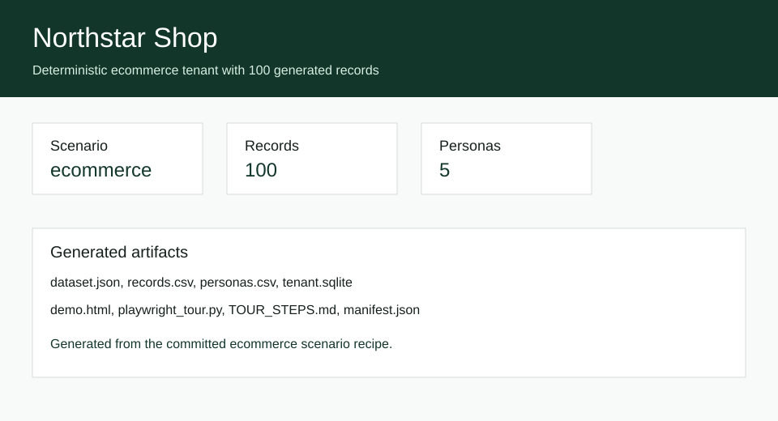

# DemoTenant Switchboard

[](https://github.com/KanadeK/demotenant-switchboard/actions/workflows/ci.yml)
[](LICENSE)
[](https://github.com/KanadeK/demotenant-switchboard/releases)

DemoTenant Switchboard generates resettable SaaS demo tenants, personas, business records, and Playwright tour scripts from YAML scenario recipes. It is for presales, solution engineering, DevRel, training, and SaaS teams who need believable demo data without copying real customer data.



- Deterministic YAML DSL to SQLite, JSON, and CSV.
- Persona switching, reset, validation, and checksum checks for repeatable demos.
- Built-in ecommerce, project management, and support desk scenarios with generated tour scripts.

Status: `v0.1.0`.

## Install

```bash
python -m pip install -e ".[dev]"
```

## Quick Start

```bash
demotenant-switchboard generate examples/ecommerce.yaml --output demo-output/ecommerce
demotenant-switchboard validate --output demo-output/ecommerce
demotenant-switchboard switch mina-ops --output demo-output/ecommerce
python demo-output/ecommerce/playwright_tour.py
```

The first command creates:

```text
demo-output/ecommerce/
  dataset.json
  records.csv
  personas.csv
  tenant.sqlite
  demo.html
  playwright_tour.py
  TOUR_STEPS.md
  manifest.json
```

Example output:

```json
{"checksum":"<sha256>","output":"demo-output/ecommerce"}
```

## Input Recipe

```yaml
kind: ecommerce
tenant:
  slug: northstar-shop
  name: Northstar Shop
personas:
  - slug: alex-admin
    role: Admin
data:
  records: 100
  seed: 2026071801
  start_date: 2026-01-01
tour:
  - title: Open overview
    actor: alex-admin
    route: /
    selector: "[data-testid='record-count']"
    assertion: 100 records
```

See `examples/` for complete recipes.

## CLI

```bash
demotenant-switchboard generate RECIPE.yaml --output demo-output/name
demotenant-switchboard validate --output demo-output/name
demotenant-switchboard reset RECIPE.yaml --output demo-output/name
demotenant-switchboard switch PERSONA --output demo-output/name
demotenant-switchboard tour --output demo-output/name
demotenant-switchboard checksum --output demo-output/name
```

## Verification

```bash
python -m ruff check .
python -m mypy src
python -m pytest -q --cov=src --cov-report=term-missing --cov-fail-under=80
python -m build
python scripts/package_release.py
python scripts/release_check.py
```

Cross-platform helper commands are available:

```bash
make verify
make demo
make package
make release-check
```

If `make` is not installed, run `python scripts/verify.py`, `python scripts/demo.py`, `python scripts/package_release.py`, and `python scripts/release_check.py`.

## Privacy And Security

DemoTenant Switchboard is offline-first. The built-in data is synthetic, seeded, and generated locally. It does not require external APIs, cookies, production databases, or customer data. Validation scans generated JSON manifests for common token-like patterns and fails if they appear.

Do not put real user data, API keys, customer exports, or private tickets in recipes. See [Privacy And Security](docs/PRIVACY_AND_SECURITY.md).

## Architecture

The package separates pure domain generation from adapters and CLI orchestration:

- `domain/`: Pydantic DSL models and deterministic record generation.
- `adapters/`: YAML, JSON, CSV, and SQLite persistence.
- `services/`: generation, reset, validation, persona switching, and tour export.
- `cli.py`: Typer command surface.

See [Architecture](docs/ARCHITECTURE.md).

## Built-In Scenarios

- Ecommerce: orders, fulfillment, refunds, and growth review.
- Project management: backlog, sprint, design validation, and launch readiness.
- Support desk: tickets, escalation, QA, and customer success follow-up.

Each scenario has at least 5 personas, 100 business records, and an 8-step tour.

## Non Goals

- It is not a production data migration tool.
- It is not an anonymizer for real customer data.
- It does not push generated records to SaaS APIs in `v0.1.0`.

## Competitor Difference

Public repository sampling did not find an active same-name, same-slug, highly isomorphic project. Nearby projects are usually tied to one product or focus only on seed rows. DemoTenant Switchboard combines a YAML scenario DSL, deterministic reset checksums, persona sessions, SQLite/JSON/CSV outputs, and generated Playwright tour artifacts. Details are in [Competitor Scan](docs/COMPETITOR_SCAN.md).

## Roadmap

- Scenario diffing and merge previews.
- Optional fixture HTTP server for adapter demos.
- More vertical packs and a small visual recipe editor.

## Contributing

See [CONTRIBUTING.md](CONTRIBUTING.md), [CODE_OF_CONDUCT.md](CODE_OF_CONDUCT.md), and [SECURITY.md](SECURITY.md).

## License

MIT. See [LICENSE](LICENSE).
