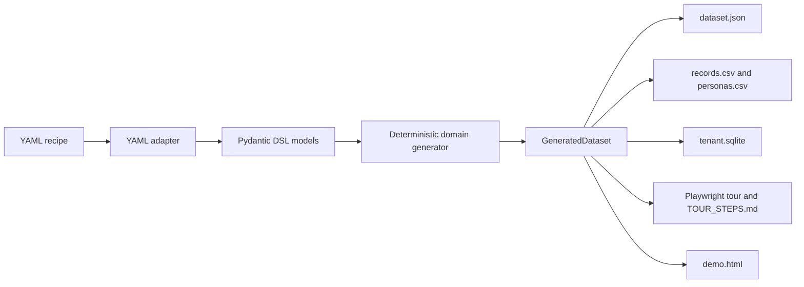

# Architecture

DemoTenant Switchboard has three layers:

1. Domain core: `src/demotenant_switchboard/domain`
2. Adapters: `src/demotenant_switchboard/adapters`
3. Services and CLI: `src/demotenant_switchboard/services` and `cli.py`

The domain layer validates recipes and generates records deterministically from `seed`, `start_date`, and `timeline_days`. It does not read files, write SQLite, call the network, or depend on wall-clock time.

Adapters handle YAML loading, JSON/CSV persistence, and SQLite writes. Services compose adapters and domain logic into user workflows: generate, reset, validate, switch persona, export tour, and export the static demo page.

The CLI is intentionally thin. It converts command-line arguments into service calls and prints machine-readable JSON so demos can be scripted.

## Data Flow

